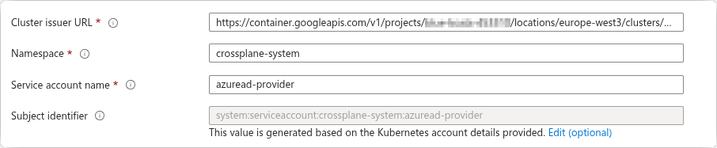
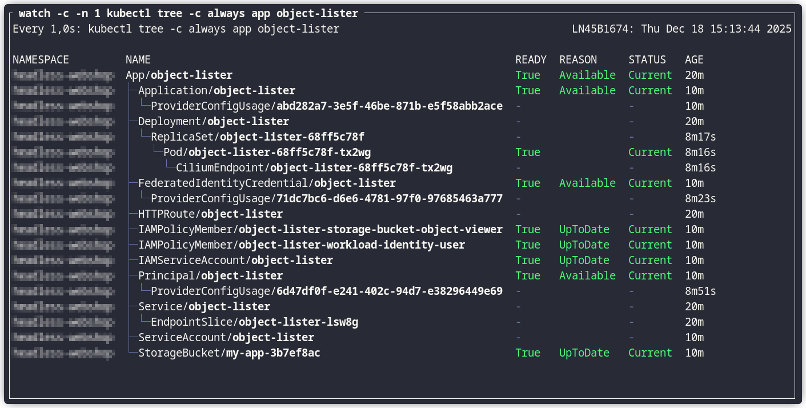

# Crossplane v2 Proof of Concept
This repository is not intended as a step-by-step guide. Instead, it includes the files and configurations that support my personal Crossplane proof of concept.

Install Crossplane
```sh
helm repo add crossplane-stable https://charts.crossplane.io/stable
helm repo update
helm install crossplane --namespace crossplane-system --create-namespace crossplane-stable/crossplane
```

[Just](https://github.com/casey/just) is used as a command runner. Run `just` to see all available commands.

```sh
$ just
Available recipes:
    [Additional Permissions]
    delete-additional-xp-permissions # Delete additional permissions for Crossplane
    deploy-additional-xp-permissions # Deploy additional permissions for Crossplane

    [Azure AD Provider]
    delete-provider-azuread          # Delete the Azure AD Provider
    deploy-provider-azuread          # Deploy the Azure AD Provider.

    [KCL Function]
    delete-kcl-function              # Delete the crossplane-contrib/function-kcl Function
    deploy-kcl-function              # Deploy the crossplane-contrib/function-kcl Function

    [example-1]
    build-object-lister tag="v1"     # Build and push the object-lister-js application
    delete-example-1                 # Delete all example-1 resources
    deploy-example-1                 # Deploy all example-1 resources
    push-all-kcl-modules             # Build and puch all KCL module.
    push-app-registration-module     # Build and puch KCL module app_registration.
    push-service-account-module      # Build and puch KCL module service_account.
    push-std-deployment-module       # Build and puch KCL module std_deployment.
    push-storage-bucket-module       # Build and puch KCL module storage_bucket.
```

> [!IMPORTANT]  
> At the top of the `./Justfile`, change the `oci_reg` variable to fit your own OCI Registry.

### Azure AD Provider

For setting up the `azuread` provider, you will need to create a standard Azure App Registration and give the service principle the `Cloud Application Administrator` role, to be able to create other App Registrations.

The `azuread` provider is setup to use Federated Credentials so you must create that as well for the App Registration.
You can get your issuer URL by running `kubectl get --raw /.well-known/openid-configuration | jq` in your cluster.



When the App Registration is created, you must go the `./crossplane/provider-azuread/cluster-provider-config.yaml` file and substitute the `tenantID` and `clientID` with your own. Then deploy the provider files.
```sh
just deploy-provider-azuread
```

## Example 1
In example-1, I explore the trade-offs and benefits of abstracting all application dependency resources behind a single Crossplane custom resource.

The goal is to deploy the `object-lister-js` application, which lists objects from a GCP Storage bucket.
The application depends on cloud resources and Azure Entra ID for SSO. All required cloud resources should be abstracted and managed by Crossplane.

**Design Requirements:**

- The application runs in a GKE cluster.
- All templating logic is implemented using KCL.
- GCP resources are provisioned via GKE Config Connector.
- The `object-lister-js` application uses Workload Identity to authenticate with Google APIs.
- Authentication with Azure Entra ID uses federated credentials.
- The Azure App Registration required for federation is created and managed by Crossplane.

---

The following Crossplane Custom Resource (XR) defines the deployment of the application and all its required dependencies.

```yaml
apiVersion: example.crossplane.io/v1
kind: App
metadata:
  name: object-lister
spec:
  image: docker.io/kerwood/object-lister:v1
  port: 3000
  hostname: lister.example.org
  serviceAccount: true
  storageBucketName: my-app-3b7ef8ac
  authentication: true
```

Based on the information derived from the `App` object, Crossplane should create the following resources:
- A Kubernetes `Deployment`, along with a `Service` and an `HTTPRoute`, for the Object Lister application.
- A Google Cloud Storage bucket that the application uses to list objects.
- A Kubernetes service account and a Google Cloud service account, with Workload Identity enabled.
- An Azure App Registration with a federated credential to support workload identity federation.

The final result will look like below.



### Setup Example 1

Deploy the KCL function.
```sh
just deploy-kcl-function
```

Crossplan will need extra permissions to manage custom resources. Deploy the additional needed roles.
```sh
just deploy-additional-xp-permissions
```


Build the `object-lister-js` application and push it to your own registry. Make sure you have changed the `oci_reg` variable in the `Justfile`.
```sh
just build-object-lister
```

Push all the KCL modules to your registry.
```sh
just push-all-kcl-modules
```

Last step is to deploy the files that manages the `App` resource. Before that, there are some default values that needs to be changed in `./crossplane/example-1/app-composition.yaml` file. This file is where all resources are rendered by the KCL modules.

- In all of the steps, change the OCI image address in the dependency block to fit your needs.
  - `storage_bucket = { oci = "oci://docker.io/kerwood/kcl-storage-bucket", version = "0.0.2" }`
- In the `create-service-account` step change the `_workloadIdentityPoolName` variable with Google project ID of your own pool.
- In the `create-deployment` step change the `_gatewayRef` variable to fit your needs.
- In the `create-app-registration` step change the `_azure_tenant_id` and `_issuer` variables.
  
Change you kubectl context your desired namespace and deploy the files. Only the `App` resources is namespace scoped.
```sh
just deploy-example-1
```

The `App` resources is now deployed and Crossplane should be rendering and reconciling it.
```sh
watch -c -n 1 kubectl tree -c always app object-lister
```

# Repository Folders and Files

## Crossplane Folder
This folder containers everything related to Crossplane.
- `./crossplane/additional-cluster-role.yaml`
    - Grants the Crossplane service account the additional permissions required to manage custom resources, specifically the GCP resources used in this project.
- `./crossplane/function-kcl.yaml`
    - Defines the `Function` resources responsible for processing KCL-based Compositions.
### provider-azureid
This folder contains configuration files for setting up the `azuread` Crossplane provider.

- `./crossplane/provider-azuread/application-example.yaml`
    - Provides an example of how to create an Azure App Registration with a federated credential.
- `./crossplane/provider-azuread/provider.yaml`
    - Installs the `azuread` Crossplane provider and references the runtime configuration defined below.
- `./crossplane/provider-azuread/deployment-runtime-config.yaml`
    - Defines a `DeploymentRuntimeConfig` resource that configures the `azuread-provider` Pod to use a dedicated service account and injects an access token for authenticating with Azure.
- `./crossplane/provider-azuread/cluster-provider-config.yaml`
    - Defines a `ClusterProviderConfig` for the `azuread` provider, specifying how to authenticate with Azure, including the tenant ID, client ID, and the location of the access token.

### example-1
This folder contains all the Crossplane resources for `example-1`.
- `./crossplane/example-1/app-xrd.yaml`
    - Defines the `CompositeResourceDefinition` (XRD) that specifies the schema for the custom `App` resource.
- `./crossplane/example-1/app-xr.yaml`
    - An instance of the custom `App` composite resource (XR).
- `./crossplane/example-1/app-composition.yaml`
    - Defines the `Composition` that implements the Crossplane pipeline, using KCL modules to render and deploy all resources required by the `App`, such as the Kubernetes Deployment, storage bucket, and service accounts.

## KCL Modules Folder
This folder contains the KCL modules used by the `Composition` pipeline to render the required resources.
- `./kcl-modules/std_deployment/`
    - Renders the Kubernetes `Deployment`, `Service`, and `HTTPRoute` resources.
- `./kcl-modules/service_account/`
    - Renders a Kubernetes service account, a Google Cloud service account, and an `IAMPolicyMember` that enables Workload Identity federation between them.
- `./kcl-modules/storage_bucket/`
    - Renders the `StorageBucket` and an `IAMPolicyMember` that grants the `roles/storage.objectViewer` role to the created Google Cloud service account.
- `./kcl-modules/app_registration/`
    - Renders the resources required to create an Azure App Registration for the Object Lister application, including a federated credential that removes the need for static credentials.

## Object Lister JS
This folder contains the NodeJS application that lists all objects in the created storage bucket.

> [!CAUTION]
> This application is Vibe coded for this specific example only and should not be used in production. 

The application requires the following environment variables:
- `BUCKET_NAME`: The name of the bucket from which objects should be listed.
- `REQUIRE_AUTH`: Boolean; when `true`, Azure SSO is enabled using Workload Identity Federation.
- `AZURE_TENANT_ID`: Your Azure tenant ID.
- `AZURE_CLIENT_ID`: The client ID of the App Registration used for SSO.
- `REDIRECT_URI`: The redirect URI for Azure to return the user to after login.
- `SESSION_SECRET`: A secret key used to encrypt user session data.

**Limitations:**
- This example application cannot scale to multiple replicas when authentication is enabled. Session data is stored in memory, so user requests must reach the same pod for authentication to work correctly.
