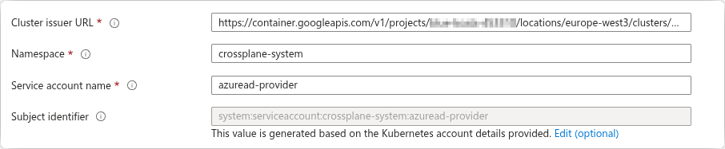
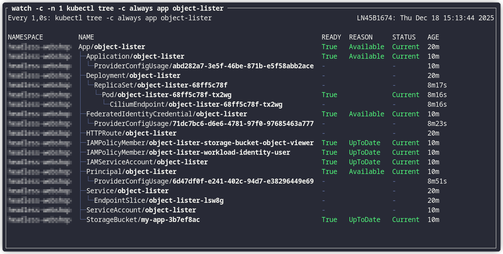

# Crossplane v2 Proof of Concept
This repository is not intended as a step-by-step guide. Instead, it includes the files and configurations that support my personal Crossplane proof of concept.

## Install Crossplane
```sh
helm repo add crossplane-stable https://charts.crossplane.io/stable
helm repo update
helm install crossplane --namespace crossplane-system --create-namespace crossplane-stable/crossplane
```

[Just](https://github.com/casey/just) is used as a command runner. Run `just` to see all available commands.

> [!IMPORTANT]
> At the top of the `./Justfile`, change the `oci_reg` variable to fit your own OCI Registry.

```sh
$ just
Available recipes:
    [Additional Permissions]
    delete-additional-xp-permissions # Delete additional permissions for Crossplane
    deploy-additional-xp-permissions # Deploy additional permissions for Crossplane

    [Azure AD Provider]
    delete-provider-azuread          # Delete the Azure AD Provider
    deploy-provider-azuread          # Deploy the Azure AD Provider.

    [KCL Function]
    delete-kcl-function              # Delete the crossplane-contrib/function-kcl Function
    deploy-kcl-function              # Deploy the crossplane-contrib/function-kcl Function

    [example-1]
    build-object-lister tag="v1"     # Build and push the object-lister-js application
    delete-example-1                 # Delete all example-1 resources
    deploy-example-1                 # Deploy all example-1 resources
    push-all-kcl-modules             # Build and push all KCL modules.
    push-app-registration-module     # Build and push KCL module app_registration.
    push-service-account-module      # Build and push KCL module service_account.
    push-std-deployment-module       # Build and push KCL module std_deployment.
    push-storage-bucket-module       # Build and push KCL module storage_bucket.
```

### Azure AD Provider

For setting up the `azuread` provider, you will need to create a standard Azure App Registration and give the service principle the `Cloud Application Administrator` role, to be able to create other App Registrations.

The `azuread` provider is setup to use Federated Credentials so you must create that as well for the App Registration.
You can get your issuer URL by running `kubectl get --raw /.well-known/openid-configuration | jq` in your cluster.



When the App Registration is created, you must go the `./crossplane/provider-azuread/cluster-provider-config.yaml` file and substitute the `tenantID` and `clientID` with your own. Then deploy the provider files.
```sh
just deploy-provider-azuread
```

## Example 1
In example-1, I explore the trade-offs and benefits of abstracting all application dependency resources behind a single Crossplane custom resource.

The goal is to deploy the `object-lister-js` application, which lists objects from a GCP Storage bucket.
The application depends on cloud resources and Azure Entra ID for SSO. All required cloud resources should be abstracted and managed by Crossplane.

**Design Requirements:**

- The application runs in a GKE cluster.
- All templating logic is implemented using KCL.
- GCP resources are provisioned via GKE Config Connector.
- The `object-lister-js` application uses Workload Identity to authenticate with Google APIs.
- Authentication with Azure Entra ID uses federated credentials.
- The Azure App Registration required for federation is created and managed by Crossplane.

---

The following Crossplane Custom Resource (XR) defines the deployment of the application and all its required dependencies.

```yaml
apiVersion: example.crossplane.io/v1
kind: App
metadata:
  name: object-lister
spec:
  image: docker.io/kerwood/object-lister:v1
  port: 3000
  hostname: lister.example.org
  serviceAccount: true
  storageBucketName: my-app-3b7ef8ac
  authentication: true
```

Based on the information derived from the `App` object, Crossplane should create the following resources:
- A Kubernetes `Deployment`, along with a `Service` and an `HTTPRoute`, for the Object Lister application.
- A Google Cloud Storage bucket that the application uses to list objects.
- A Kubernetes service account and a Google Cloud service account, with Workload Identity enabled.
- An Azure App Registration with a federated credential to support workload identity federation.

The final result will look like below.



## Setup Example 1

Deploy the KCL function.
```sh
just deploy-kcl-function
```

Crossplane will need extra permissions to manage custom resources. Deploy the additional needed roles.
```sh
just deploy-additional-xp-permissions
```


Build the `object-lister-js` application and push it to your own registry. Make sure you have changed the `oci_reg` variable in the `Justfile`.
```sh
just build-object-lister
```

Push all the KCL modules to your registry.
```sh
just push-all-kcl-modules
```

Last step is to deploy the files that manages the `App` resource. Before that, there are some default values that needs to be changed in `./crossplane/example-1/app-composition.yaml` file. This file is where all resources are rendered by the KCL modules.

- In all of the steps, change the OCI image address in the dependency block to fit your needs.
  - `storage_bucket = { oci = "oci://docker.io/kerwood/kcl-storage-bucket", version = "0.0.2" }`
- In the `create-service-account` step change the `_workloadIdentityPoolName` variable with Google project ID of your own pool.
- In the `create-deployment` step change the `_gatewayRef` variable to fit your needs.
- In the `create-app-registration` step change the `_azure_tenant_id` and `_issuer` variables.
  
Change your kubectl context to your desired namespace and deploy the files. Only the `App` resource is namespace scoped.
```sh
just deploy-example-1
```

The `App` resource is now deployed and Crossplane should be rendering and reconciling it.
```sh
watch -c -n 1 kubectl tree -c always app object-lister
```

## Conclusion - Example 1

#### Single resource for all
My conclusion from the Example 1 PoC is that consolidating everything into a single Crossplane resource,
one abstraction that provisions all underlying resources, makes the Composition pipeline extremely difficult to maintain.
It essentially recreates the same problem as a monolithic Helm chart (the Helm chart to rule them all).

ArgoCD's Sync Wave feature allows resources to be synced in a specific order, for example, ensuring a SQL instance is fully provisioned before the deployment resource is synced.
Relying on a single Crossplane resource eliminates the ability to leverage Sync Phases and Waves, forcing you to implement and manage that ordering logic entirely within the Composition pipeline itself.

#### KCL
For writing the Composition functions, I used KCL, a YAML-based configuration language with strong Kubernetes support.
I was genuinely impressed. It has a low learning curve, a pleasant developer experience, and the ability to generate KCL structs directly from Kubernetes CRDs.

That said, there are a few concerns. The project is currently under-maintained, at the time of writing, it has been 11 months since the last patch release.
Additionally, since the project originates from a non-English-speaking community and no language policy is enforced,
a portion of the repository's issues and discussions are written in languages other than English, which creates a barrier for international contributors and users.

On the technical side, while KCL supports writing reusable packages for use within a Composition (as demonstrated in my example), certain parts of the function logic still need to be written as inline YAML. This is a limitation shared with several other supported languages and adds unnecessary friction to the development experience.
Despite its promise, I don't believe KCL is enterprise-ready in its current state.

## Example 2

In Example 2, I want to explore the trade-offs and benefits of splitting Crossplane resources by concern,
and compare the experience of writing Composition functions in Go versus KCL.

The goal is to define two distinct resources, `XDeployment`, responsible for deploying an application, and `XAppRegistration`,
which provisions the necessary Entra ID resources. 

**Design Requirements**
- The application runs in a GKE cluster.
- All Composition function logic is implemented in Go.
- Authentication with Azure Entra ID is handled via Federated Credentials, avoiding the use of static client secrets.
- The Azure App Registration required to establish federation is provisioned and managed by Crossplane.
- The deployment resource must support SSO through an authentication proxy.

### XDeployment
Below is the `XDeployment` resource, which exposes the fields you would typically expect from a deployment abstraction.
The `singleSignOn.enableAuthProxy` field enables the OAuth2 Proxy sidecar, and `singleSignOn.connectionDetailsSecretRef`
references a secret created by `XAppRegistration` that contains the connection details OAuth2 Proxy needs to authenticate against Entra ID.

```yaml
apiVersion: example.org/v1
kind: XDeployment
metadata:
  name: nginx-demo
spec:
  # Required, creates a Deployment.
  image: nginxdemos/hello
  tag: latest

  # Optional, creates a Service.
  port: 80

  # Optional, creates a HTTPRoute.
  hostname: example.org

  # Optional, defaults to two.
  replicas: 2

  # Optional, environment variables.
  env:
    ENV: production

  # Optional: configures the deployment with a serviceAccountName.
  # Defaults to "default".
  serviceAccountName: nginx-demo
  
  # Optional.
  singleSignOn:
    # Optional, if the application does not have built-in authentication,
    # enableAuthProxy adds an authentication proxy sidecar to the deployment.
    enableAuthProxy: true

    # Required, reference an XAppRegistration resource
    connectionDetailsSecretRef:
      name: nginx-demo-connection-details
```

### XAppRegistration

Below is the `XAppRegistration` resource. The `serviceAccountName` field is required as it is referenced by the
Federated Credential on the App Registration, enabling workload identity federation without a static secret.

A redirect URL is also required to complete the OAuth2 flow.

Optionally, you can define roles on the App Registration and assign Entra ID groups to them.
When no role assignments are configured, any valid Entra ID user is permitted to sign in.
Once a role is configured however, users must be a member of at least one of the groups assigned to that role in order to gain access.

The `writeConnectionSecretToRef` field specifies the name of the Kubernetes secret that the Crossplane function will populate with
the connection details consumed by OAuth2 Proxy.

```yaml
apiVersion: example.org/v1
kind: XAppRegistration
metadata:
  name: nginx-demo
spec:
  # Required
  serviceAccountName: nginx-demo

  # Required, allowed redirect URLs.
  redirectURLs:
    - http://localhost
    - https://oauth.pstmn.io/v1/browser-callback

  # Optional. all sub-fields are required is used.
  roleAssignments:
    - roleName: Reader
      description: Grants read access to users
      assignedGroups:
        - f7455ef4-3c15-4dc3-8faa-3023f956a90d

    - roleName: Writer
      description: Grants write access to users
      assignedGroups:
        - f7455ef4-3c15-4dc3-8faa-3023f956a90d
        - 374e01fd-5e0f-4a8a-a825-1720feaf9201

  # Optional. Write connection details to a secret.
  writeConnectionSecretToRef:
    name: nginx-demo-connection-details
```

## Components

The following components were built to support Example 2 and address the limitations of writing Crossplane functions in Go without a shared framework.

You can find documentation on creating Go functions [here](https://docs.crossplane.io/latest/guides/write-a-composition-function-in-go/).  
The official example is intentionally simple, but once you start composing multiple resources you quickly realize that a lot of code gets repeated. This makes it necessary to centralize common logic.

Another challenge is that the XRD must be written by hand, and working with the unstructured data from the XR is not very efficient.

### Crossplane XRD Generator

To address the problems of manually writing XRDs and handling unstructured XR data, I created [crossplane-xrd-generator](https://github.com/Kerwood/crossplane-xrd-generator).
With this tool, you define a Go struct and annotate its fields with kubebuilder markers to describe the schema.

The same struct can then be used for:
- Generating the XRD
- Converting unstructured XR data into a typed Go struct

This allows you to work with strongly typed data instead of manually handling unstructured objects.

### Composer
One of the trade-offs of writing Crossplane functions in Go is that you essentially need to build your own framework for code reuse.
In the `go-modules` folder you will find the `composer` package, which provides shared abstractions used by the functions.

Without going into too much detail, it includes:
- `FunctionContext` and `DesiredResource` structs
- A `ComposeableResource` interface
- A `BaseComposer` struct with default implementations

These components provide a reusable foundation for defining and composing managed resources.

### Crossplane Go Functions
In the `go-modules` folder you will also find two Crossplane functions written in Go:
- `xdeployment`
- `xappregistration`

Both follow the same structure and make use of the shared `composer` package.

## Setup Example 2

First, follow the instructions in the [Azure AD Provider](#azure-ad-provider) section to configure the provider so it can create Entra ID App Registrations.

You will also need the [Crossplane CLI](https://docs.crossplane.io/latest/cli/).

Each function includes a `Justfile` that can be used to build and publish the function image. Start by navigating to the `xappregistration` folder and updating the `oci_image` variable at the top of the `Justfile`. You must also update the same image reference in `example/functions.yaml`.

Next, run the `build-n-push` recipe. Use the same version that is specified in `example/function.yaml`.
```sh
just build-n-push v0.4.3
```


After the image has been published, open `example/composition.yaml`.  
The `input` field defines the default values used by the function. Adjust these values to match your requirements.

Deploy the required `functions.yaml`, `composition.yaml`, and `xrd.yaml` resources to Kubernetes:
```sh
just deploy-all
```

The function is now ready to run. Modify `example/xr.yaml` to match your desired configuration and deploy it to Kubernetes.

If everything is configured correctly, Crossplane will create the required App Registration resources and generate a Kubernetes secret containing the necessary details for the `XDeployment` to consume when configuring OAuth2Proxy.

Next, repeat the same process for the `xdeployment` function.

> [!NOTE]
> This example does not include the required Kubernetes service account. It must be created beforehand.
```sh
kubectl create serviceaccount nginx-demo
```

## Conclusion - Example 2

Splitting resources into independent units makes each one easier to maintain and work on in isolation.
It also restores the ability to control sync order in ArgoCD using Sync Phases and Waves, one of the key limitations identified in Example 1.

The main challenge is sharing information between XRs. In this example, the `XAppRegistration` needed to pass its client ID and issuer URL to the `XDeployment`.
The way to handle this is to have the user specify a Secret or ConfigMap name on the producing resource,
which the function writes the data to, and then reference that same name on the consuming resource.
It works, but it does place some coordination burden on the user.

After building two Crossplane PoCs, one with KCL and one with Go, I had a better overall experience with Go.
The main downside is the steep learning curve and the overhead of building your own framework for code reuse.
The upside is that you leave inline YAML behind and work in a proper programming language, which opens up significantly more flexibility,
for example, calling external APIs or querying the cluster directly.

# Repository Folders and Files

## Crossplane Folder
This folder contains everything related to Crossplane.
- `./crossplane/additional-cluster-role.yaml`
    - Grants the Crossplane service account the additional permissions required to manage custom resources, specifically the GCP resources used in this project.
- `./crossplane/function-kcl.yaml`
    - Defines the `Function` resources responsible for processing KCL-based Compositions.
### provider-azuread
This folder contains configuration files for setting up the `azuread` Crossplane provider.

- `./crossplane/provider-azuread/application-example.yaml`
    - Provides an example of how to create an Azure App Registration with a federated credential.
- `./crossplane/provider-azuread/provider.yaml`
    - Installs the `azuread` Crossplane provider and references the runtime configuration defined below.
- `./crossplane/provider-azuread/deployment-runtime-config.yaml`
    - Defines a `DeploymentRuntimeConfig` resource that configures the `azuread-provider` Pod to use a dedicated service account and injects an access token for authenticating with Azure.
- `./crossplane/provider-azuread/cluster-provider-config.yaml`
    - Defines a `ClusterProviderConfig` for the `azuread` provider, specifying how to authenticate with Azure, including the tenant ID, client ID, and the location of the access token.

### example-1
This folder contains all the Crossplane resources for `example-1`.
- `./crossplane/example-1/app-xrd.yaml`
    - Defines the `CompositeResourceDefinition` (XRD) that specifies the schema for the custom `App` resource.
- `./crossplane/example-1/app-xr.yaml`
    - An instance of the custom `App` composite resource (XR).
- `./crossplane/example-1/app-composition.yaml`
    - Defines the `Composition` that implements the Crossplane pipeline, using KCL modules to render and deploy all resources required by the `App`, such as the Kubernetes Deployment, storage bucket, and service accounts.

## Go Modules Folder
This folder contains the Go Functions used by the `Composition` pipeline to render the required resources in Example 2.
- `./go-modules/composer`
    - The `composer` package provides shared abstractions used by the functions.
- `./go-modules/xdeployment`
    - The `XDeployment` function that creates a `Deployment`, `Service` and `HTTPRoute`.
- `./go-modules/xappregistration`
    - The `XAppRegistration` function that creates the resources for the Entra ID App Registration.

## KCL Modules Folder
This folder contains the KCL modules used by the `Composition` pipeline to render the required resources.
- `./kcl-modules/std_deployment/`
    - Renders the Kubernetes `Deployment`, `Service`, and `HTTPRoute` resources.
- `./kcl-modules/service_account/`
    - Renders a Kubernetes service account, a Google Cloud service account, and an `IAMPolicyMember` that enables Workload Identity federation between them.
- `./kcl-modules/storage_bucket/`
    - Renders the `StorageBucket` and an `IAMPolicyMember` that grants the `roles/storage.objectViewer` role to the created Google Cloud service account.
- `./kcl-modules/app_registration/`
    - Renders the resources required to create an Azure App Registration for the Object Lister application, including a federated credential that removes the need for static credentials.

## Object Lister JS
This folder contains the NodeJS application that lists all objects in the created storage bucket.

> [!CAUTION]
> This application is vibe coded for this specific example only and should not be used in production.

The application requires the following environment variables:
- `BUCKET_NAME`: The name of the bucket from which objects should be listed.
- `REQUIRE_AUTH`: Boolean; when `true`, Azure SSO is enabled using Workload Identity Federation.
- `AZURE_TENANT_ID`: Your Azure tenant ID.
- `AZURE_CLIENT_ID`: The client ID of the App Registration used for SSO.
- `REDIRECT_URI`: The redirect URI for Azure to return the user to after login.
- `SESSION_SECRET`: A secret key used to encrypt user session data.

**Limitations:**
- This example application cannot scale to multiple replicas when authentication is enabled. Session data is stored in memory, so user requests must reach the same pod for authentication to work correctly.
